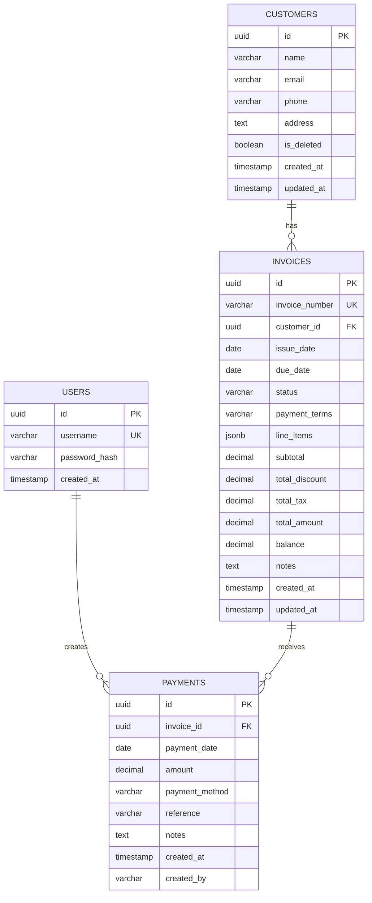

# Database Schema Documentation

## Overview

The InvoiceMe database uses PostgreSQL 15 and follows a normalized relational design with strong foreign key constraints and indexes for optimal query performance. The schema supports the three main bounded contexts: Customer, Invoice, and Payment.

## Entity Relationship Diagram



## Tables

### users

Stores user authentication information for the system.

**Purpose:** Manage user accounts and authentication credentials

| Column | Type | Constraints | Description |
|--------|------|-------------|-------------|
| id | UUID | PRIMARY KEY | Unique identifier for the user |
| username | VARCHAR(100) | UNIQUE NOT NULL | Username for login (email address) |
| password_hash | VARCHAR(255) | NOT NULL | BCrypt hashed password |
| created_at | TIMESTAMP | DEFAULT CURRENT_TIMESTAMP | Account creation timestamp |

**Indexes:**
- PRIMARY KEY on `id`
- UNIQUE INDEX on `username`

**Business Rules:**
- Passwords must be hashed using BCrypt before storage
- Usernames are case-insensitive email addresses
- Default user for demo: `admin@example.com` / `password`

---

### customers

Stores customer/client information for invoicing.

**Purpose:** Manage customer master data with soft delete capability

| Column | Type | Constraints | Description |
|--------|------|-------------|-------------|
| id | UUID | PRIMARY KEY | Unique identifier for the customer |
| name | VARCHAR(255) | NOT NULL | Customer name (company or individual) |
| email | VARCHAR(255) | NOT NULL | Primary contact email |
| phone | VARCHAR(50) | NULL | Contact phone number |
| address | TEXT | NULL | Full billing address |
| is_deleted | BOOLEAN | DEFAULT FALSE | Soft delete flag |
| created_at | TIMESTAMP | DEFAULT CURRENT_TIMESTAMP | Record creation timestamp |
| updated_at | TIMESTAMP | DEFAULT CURRENT_TIMESTAMP | Last update timestamp |

**Indexes:**
- PRIMARY KEY on `id`
- INDEX on `email` for search/filtering
- INDEX on `is_deleted` for filtering active customers

**Business Rules:**
- Soft delete: Set `is_deleted = true` instead of removing records
- Email should be validated at application layer
- Name is required, other fields optional
- Updated_at automatically updated via trigger or application code

**Sample Data:**
```sql
INSERT INTO customers (id, name, email, phone, address, is_deleted) VALUES
('550e8400-e29b-41d4-a716-446655440000', 'Acme Corporation', 'billing@acme.com', '+1-555-0100', '123 Business St, New York, NY 10001', false),
('6ba7b810-9dad-11d1-80b4-00c04fd430c8', 'Tech Solutions Inc', 'accounts@techsolutions.com', '+1-555-0200', '456 Tech Ave, San Francisco, CA 94102', false);
```

---

### invoices

Stores invoice documents with embedded line items as JSON.

**Purpose:** Manage invoice lifecycle from Draft to Paid with calculated totals

| Column | Type | Constraints | Description |
|--------|------|-------------|-------------|
| id | UUID | PRIMARY KEY | Unique identifier for the invoice |
| invoice_number | VARCHAR(50) | UNIQUE NOT NULL | Human-readable invoice number (e.g., INV-2024-0001) |
| customer_id | UUID | FOREIGN KEY REFERENCES customers(id) | Link to customer |
| issue_date | DATE | NOT NULL | Date invoice was created/issued |
| due_date | DATE | NOT NULL | Payment due date |
| status | VARCHAR(20) | NOT NULL CHECK (status IN ('Draft', 'Sent', 'Paid')) | Invoice lifecycle status |
| payment_terms | VARCHAR(100) | NULL | Payment terms (e.g., "Net 30", "Due on receipt") |
| line_items | JSONB | NOT NULL DEFAULT '[]' | Array of line item objects |
| subtotal | DECIMAL(10,2) | NOT NULL DEFAULT 0 | Sum of line item subtotals (before tax) |
| total_discount | DECIMAL(10,2) | NOT NULL DEFAULT 0 | Sum of all discount amounts |
| total_tax | DECIMAL(10,2) | NOT NULL DEFAULT 0 | Sum of all tax amounts |
| total_amount | DECIMAL(10,2) | NOT NULL DEFAULT 0 | Final invoice total (subtotal - discount + tax) |
| balance | DECIMAL(10,2) | NOT NULL DEFAULT 0 | Outstanding balance (total_amount - payments) |
| notes | TEXT | NULL | Optional invoice notes/comments |
| created_at | TIMESTAMP | DEFAULT CURRENT_TIMESTAMP | Record creation timestamp |
| updated_at | TIMESTAMP | DEFAULT CURRENT_TIMESTAMP | Last update timestamp |

**Indexes:**
- PRIMARY KEY on `id`
- UNIQUE INDEX on `invoice_number`
- INDEX on `customer_id` for customer invoice list queries
- INDEX on `status` for filtering by status
- INDEX on `due_date` for overdue invoice queries

**Foreign Keys:**
- `customer_id` REFERENCES `customers(id)` - Links invoice to customer

**Business Rules:**
- Invoice number format: `INV-YYYY-####` (e.g., INV-2024-0001)
- Status transitions: Draft → Sent → Paid (one-way only)
- Line items cannot be modified after status is 'Sent'
- Balance must be <= total_amount
- Due date must be >= issue_date

**Line Items JSON Structure:**
```json
[
  {
    "id": "uuid",
    "description": "Web Development Services",
    "quantity": 40.0,
    "unitPrice": 100.00,
    "discountPercent": 0.10,
    "taxRate": 0.08,
    "subtotal": 4000.00,
    "discountAmount": 400.00,
    "taxableAmount": 3600.00,
    "taxAmount": 288.00,
    "total": 3888.00
  }
]
```

**Sample Data:**
```sql
INSERT INTO invoices (id, invoice_number, customer_id, issue_date, due_date, status, payment_terms, line_items, subtotal, total_discount, total_tax, total_amount, balance) VALUES
('7c9e6679-7425-40de-944b-e07fc1f90ae7', 'INV-2024-0001', '550e8400-e29b-41d4-a716-446655440000', '2024-01-15', '2024-02-14', 'Sent', 'Net 30',
'[{"id":"item-1","description":"Consulting Services","quantity":10,"unitPrice":150,"discountPercent":0,"taxRate":0.08,"subtotal":1500,"discountAmount":0,"taxableAmount":1500,"taxAmount":120,"total":1620}]',
1500.00, 0.00, 120.00, 1620.00, 1620.00);
```

---

### payments

Stores payment transactions applied to invoices.

**Purpose:** Record payment history and track invoice balance reduction

| Column | Type | Constraints | Description |
|--------|------|-------------|-------------|
| id | UUID | PRIMARY KEY | Unique identifier for the payment |
| invoice_id | UUID | FOREIGN KEY REFERENCES invoices(id) | Link to invoice being paid |
| payment_date | DATE | NOT NULL | Date payment was received/made |
| amount | DECIMAL(10,2) | NOT NULL CHECK (amount > 0) | Payment amount (must be positive) |
| payment_method | VARCHAR(50) | NOT NULL CHECK (payment_method IN ('CreditCard', 'BankTransfer', 'Check', 'Cash')) | Payment method used |
| reference | VARCHAR(255) | NULL | Transaction reference, check number, etc. |
| notes | TEXT | NULL | Optional payment notes |
| created_at | TIMESTAMP | DEFAULT CURRENT_TIMESTAMP | Record creation timestamp |
| created_by | VARCHAR(255) | NOT NULL | Username of user who recorded payment |

**Indexes:**
- PRIMARY KEY on `id`
- INDEX on `invoice_id` for payment history queries
- INDEX on `payment_date` for date range queries

**Foreign Keys:**
- `invoice_id` REFERENCES `invoices(id)` - Links payment to invoice

**Business Rules:**
- Payment amount must be positive (> 0)
- Cannot exceed invoice balance at time of payment
- Payment date can be in the past or present, not future
- Valid payment methods: CreditCard, BankTransfer, Check, Cash
- Multiple partial payments allowed per invoice
- Recording a payment updates invoice.balance automatically

**Sample Data:**
```sql
INSERT INTO payments (id, invoice_id, payment_date, amount, payment_method, reference, created_by) VALUES
('9b9f8e47-2f3d-4e7d-9c4a-1e5f6d7c8b9a', '7c9e6679-7425-40de-944b-e07fc1f90ae7', '2024-01-20', 1000.00, 'BankTransfer', 'TXN-20240120-001', 'admin@example.com');
```

---

## Database Functions & Sequences

### invoice_number_seq

Sequence used to generate sequential invoice numbers.

```sql
CREATE SEQUENCE invoice_number_seq START 1;
```

**Usage:** Increments for each new invoice to ensure unique numbering

### generate_invoice_number()

Function to generate formatted invoice numbers.

```sql
CREATE OR REPLACE FUNCTION generate_invoice_number()
RETURNS VARCHAR AS $$
BEGIN
    RETURN 'INV-' || EXTRACT(YEAR FROM CURRENT_DATE) || '-' || LPAD(nextval('invoice_number_seq')::TEXT, 4, '0');
END;
$$ LANGUAGE plpgsql;
```

**Returns:** Formatted invoice number like `INV-2024-0001`

**Usage:**
```sql
SELECT generate_invoice_number(); -- Returns: INV-2024-0001
```

---

## Indexing Strategy

### Performance Indexes

1. **customers.email**: Speeds up customer search by email
2. **customers.is_deleted**: Optimizes queries filtering active customers
3. **invoices.customer_id**: Fast lookup of customer invoices
4. **invoices.status**: Efficient filtering by invoice status
5. **invoices.due_date**: Quick identification of overdue invoices
6. **invoices.invoice_number**: Fast search by invoice number
7. **payments.invoice_id**: Rapid payment history retrieval
8. **payments.payment_date**: Date range queries for reports

### Composite Indexes (Future Optimization)

Consider adding composite indexes if query patterns reveal the need:

```sql
-- If frequently filtering by customer and status together
CREATE INDEX idx_invoices_customer_status ON invoices(customer_id, status);

-- If frequently filtering by payment date range and method
CREATE INDEX idx_payments_date_method ON payments(payment_date, payment_method);
```

---

## Data Constraints & Validation

### Check Constraints

1. **invoices.status**: Must be 'Draft', 'Sent', or 'Paid'
2. **payments.payment_method**: Must be 'CreditCard', 'BankTransfer', 'Check', or 'Cash'
3. **payments.amount**: Must be greater than 0

### Foreign Key Constraints

- **ON DELETE**: Currently set to default (RESTRICT) - prevents deletion of referenced records
- **Consideration**: Could use ON DELETE CASCADE for payments when invoice is deleted (business decision)

### Application-Level Validation

The following validations are enforced at the application layer:

1. Email format validation
2. Phone number format validation
3. Invoice balance <= total_amount
4. Payment amount <= invoice balance at time of recording
5. Invoice status transitions (Draft → Sent → Paid only)
6. Line item calculations accuracy

---

## Migration Strategy

### Flyway Migrations

Database changes are managed through Flyway migration scripts located in:
```
backend/src/main/resources/db/migration/
```

**Migration Naming Convention:**
- `V1__initial_schema.sql` - Initial database setup
- `V2__add_payment_notes.sql` - Add notes column to payments
- `V3__add_customer_indexes.sql` - Performance optimization

**Running Migrations:**
```bash
cd backend
mvn flyway:migrate
```

**Migration Rules:**
1. Never modify existing migration files
2. Always create new migration for schema changes
3. Test migrations on dev database first
4. Include both UP and DOWN migration logic (if reversible)
5. Document breaking changes in migration comments

---

## Backup & Recovery

### Backup Strategy

**Development:**
```bash
# Backup
pg_dump -h localhost -p 54322 -U postgres invoiceme > backup.sql

# Restore
psql -h localhost -p 54322 -U postgres invoiceme < backup.sql
```

**Production:**
- Automated daily backups via cloud provider (AWS RDS, Azure PostgreSQL)
- Point-in-time recovery enabled
- Backups retained for 30 days
- Weekly backup tests to verify integrity

### Data Recovery Procedures

1. **Accidental Delete:** Use soft delete and is_deleted flag
2. **Data Corruption:** Restore from latest backup
3. **Point-in-time Recovery:** Use cloud provider PITR feature

---

## Performance Considerations

### Query Optimization

1. **Use Indexes:** All foreign keys and frequently queried columns are indexed
2. **Avoid N+1 Queries:** Use JPA @EntityGraph or JOIN FETCH
3. **Pagination:** Always paginate large result sets (invoices, customers)
4. **JSONB Performance:** Line items stored as JSONB for flexibility, consider normalizing if performance degrades

### Connection Pooling

**HikariCP Configuration (Spring Boot):**
```yaml
spring:
  datasource:
    hikari:
      maximum-pool-size: 10
      minimum-idle: 5
      connection-timeout: 20000
      idle-timeout: 300000
      max-lifetime: 1200000
```

### Monitoring

**Key Metrics to Monitor:**
- Connection pool utilization
- Slow query log (queries > 1 second)
- Table sizes and growth rate
- Index usage statistics

**Useful Queries:**
```sql
-- Find slow queries
SELECT * FROM pg_stat_statements ORDER BY mean_time DESC LIMIT 10;

-- Check index usage
SELECT schemaname, tablename, indexname, idx_scan
FROM pg_stat_user_indexes
WHERE idx_scan = 0;

-- Table sizes
SELECT table_name, pg_size_pretty(pg_total_relation_size(quote_ident(table_name)))
FROM information_schema.tables
WHERE table_schema = 'public'
ORDER BY pg_total_relation_size(quote_ident(table_name)) DESC;
```

---

## Security Considerations

### Access Control

1. **Application User:** Has full CRUD permissions on all tables
2. **Read-Only User:** For reporting/analytics (future)
3. **Migration User:** Schema modification permissions only

### Data Protection

1. **Password Hashing:** BCrypt with work factor 12
2. **SQL Injection Prevention:** Use parameterized queries (JPA handles this)
3. **Audit Trail:** created_at, updated_at, created_by columns track changes
4. **Soft Delete:** Preserves data for audit purposes

### Compliance

- **PII Data:** Customer email, phone, address are PII
- **GDPR Considerations:** Implement data export and deletion procedures
- **Data Retention:** Define retention policy for soft-deleted records

---

## Schema Version

**Current Version:** V1.0
**Last Updated:** 2024-11-09
**Database:** PostgreSQL 15
**Managed By:** Flyway

For questions or schema change requests, contact the development team.
